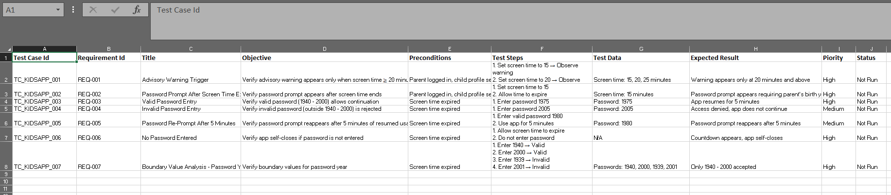

# KidsLearningApp-TestCases
Sample ISTQB Foundation test suite demonstrating structured test case design for a kids’ learning app with parental controls.

This repository contains a structured test suite for a kids’ learning application with parental controls.  
It demonstrates ISTQB techniques such as boundary value analysis, positive/negative testing, and usability/security validation.  

## Files
- **KidsApp-TestCase_001.xlsx** → Includes a professional cover page and formatted test suite.  
- **KidsApp-TestCase_001.csv** → Lightweight version for quick preview and tool import.  

## Notes
- Status values are set to *Not Run* as this is a sample design portfolio.  
- In a real project, statuses would be updated during execution in tools like TestRail or Jira Zephyr.

